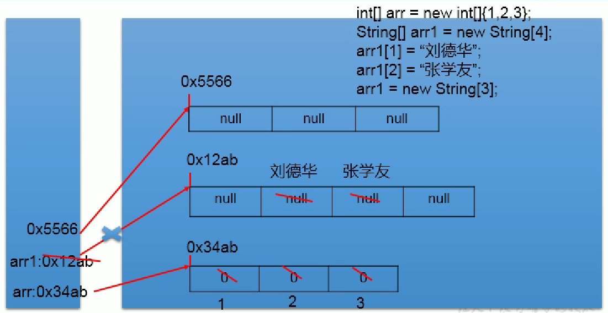

# 11/27 

## Java基础P1 - P134

### JDK & JRE & JVM区别和联系

JDK(Java Development Kit)   java开发工具包，包含JRE和开发工具（编译工具javac.exe   打包工具jar.exe）

JRE(Java Runtime Environment)   java运行环境

JVM(Java Virtual Machine)   Java虚拟机

JDK = JRE + 开发工具集

JRE = JVM + JavaSE标准类库

### java运行流程

.java文件（源文件），通过javac.exe编译成.class文件（字节码文件）,再通过java.exe运行

IDE: 集成开发环境

### 8种基本数据类型

整数类型（byte 1字节8bit，short 2字节，int 4字节，long 8字节）浮点类型（float 4字节，double 8字节）字符型（char 1字符=2字节）布尔型（boolean）

### 3种引用数据类型

类（class  //字符串在这里）接口（interface）数组（[]）

### ASCll码

A-->65   a-->97

## 数据结构和算法P1-P17

线性结构和非线性结构

线性结构的特点是**数据元素之间存在一对一**的的线性关系

线性结构分为**顺序存储结构(数组)**和**链式存储结构(链表)**

线性结构常见的有：**数组、队列、链表和栈**

非线性结构包括：**二维数组、多维数组、广义表、树、图**

### 稀疏数组


原始二维数组有很多多余的0，所以采用**稀疏数组**

**稀疏数组**第一行记录一共有几行几列，有多少个不同的值

把有不同值元素的行列记录下来，从而缩小程序的规模

|      | row  | col  | val  |
| ---- | ---- | ---- | ---- |
| 0    | 11   | 11   | 2    |
| 1    | 1    | 2    | 1    |
| 2    | 2    | 3    | 2    |

### 队列

队列是一个**有序列表**，可以用**数组**或者**链表**实现，遵循**先入先出**

#### 有序队列

因为队列的输出和输入是分别从前后端来处理，因此需要两个变量front和rear分别记录队列前后端的下标，front随数据输出而改变，rear随数据输入而改变

>front,rear初始值都为-1，front指向队列头的前一个位置，rear指向队列最后一个数据

非环形队列为一次性队列，如果队列已满，取出数据后仍然无法添加新数据

#### 数组模拟环形队列

通过取模的方法实现环形队列

> front,rear初始值都为0，front指向队列头的位置，rear指向队列最后一个数据+1

***rear = front为空***          ***(rear+1)%maxSize = front为满***          ***(rear + maxSize - front)%maxSize为元素个数***

==理解要点:rear指向预留的空位置==   rear变量的含义调整为指向队列的最后一个元素的后一位，rear初始值为0；（队列最后一位被牺牲，不会用到，因为希望空出一个位置来做约定，判断队列是否满）（满的情况是除了最后一个被浪费，其余都有数据）,所以说队列问题是比如你得size是1,就算里面没数据,队列也算满了。

预留一个空间是为了避免判空和判满条件一致

添加一个元素后rear移动式子:rear = (rear+1)%maxSize，其中+1是为了后移一位，模是为了不越界，一个循环。

### 链表

链表是有序的列表，以节点的方式存储，节点包含data域（存数据）和next域（指向下一个节点）

链表的各个节点不一定是连续存储的，链表分为带头节点和不带头节点的链表

#### 单向链表的创建和不按顺序插入

```java
public class SingleLinkedListDemo {
    public static void main(String[] args) {
        HeroNode hero1 = new HeroNode(1, "宋江", "及时雨");
        HeroNode hero2 = new HeroNode(2, "卢俊义", "玉麒麟");
        HeroNode hero3 = new HeroNode(3, "吴用", "智多星");
        HeroNode hero4 = new HeroNode(4, "林冲", "豹子头");

        SingleLinkedList singleLinkedList = new SingleLinkedList();
        singleLinkedList.add(hero1);
        singleLinkedList.add(hero2);
        singleLinkedList.add(hero3);
        singleLinkedList.add(hero4);
        singleLinkedList.list();
    }
}

//定义SingleLinkedList，管理英雄
class SingleLinkedList {
    //先初始化一个头节点，不能改变,不存放具体数据
    private HeroNode head = new HeroNode(0, "", "");

    /*
    添加节点到单项链表
    找到当前链表的最后节点
    将这个节点的next指向新的节点
     */
    public void add(HeroNode heroNode) {

        //因为head节点不能改变，因此需要一个辅助变量
        //***************************************************************************
      	//这边temp和head指向统一堆空间的变量，所以此时改变temp中next的值也同时改变head中next的值
        //***************************************************************************
        HeroNode temp = head;

        while (true) {
            if (temp.next == null) {
                break;
            }
            //如果没找到最后，则将temp后移
            temp = temp.next;
        }
        //退出while循环时，temp指向链表最后,将最后节点的next指向新的节点
        temp.next = heroNode;
    }

    //显示链表，遍历
    public void list() {
        if (head.next == null) {
            System.out.println("链表为空");
            //链表为空
            return;
        }
        HeroNode temp = head.next;
        while (true) {
            if (temp == null) {
                break;
            }
            System.out.println(temp);
            //将temp.next后移
            temp = temp.next;
        }
    }
}

//定义HeroNode，每一个HeroNode对象就是一个节点
class HeroNode {
    //英雄编号
    public int no;
    //英雄名字
    public String name;
    //英雄昵称
    public String nickName;
    //下一个节点，也是一个对象
    public HeroNode next;

    public HeroNode(int no, String name, String nickName) {
        this.no = no;
        this.name = name;
        this.nickName = nickName;
    }

    @Override
    public String toString() {
        return "HeroNode{" +
                "no=" + no +
                ", name='" + name + '\'' +
                ", nickName='" + nickName + '\'' +
                '}';
    }
}
```

# 11/28

## Java基础P137-P218

内存的简化结构分为：栈，堆，方法区

栈中存放局部变量，堆中存放new出来的结构，方法区包含常量池和静态域


数组的内存分配



方法结束后变量出栈，指针消失后自动回收

## 数据结构和算法P18-P29

### 单链表


#### 按顺序添加新的节点

新的节点.next = temp.next

temp.next = 新的节点


#### 链表节点删除

temp.next = temp.next.next


### 双向链表

即在单向链表中添加pre属性

#### 删除节点

temp.pre.next = temp.next

temp.next.pre = temp.pre

### 单向环形链表（约瑟夫问题）

**约瑟夫问题**：N个人围成一圈，从第一个开始报数，第M个将被杀掉，最后剩下一个，其余人都将被杀掉。求被杀的顺序？

例如N=6，M=5，被杀掉的顺序是：5，4，6，2，3。

思路：添加一个辅助指针helper，事先指向环形链表最后这个节点。每报一个数，first和helper同时移动一次，最终移动M-1次。这时将first节点指向的变量出圈：**first = first.next**   **helper.next = first**，原先first指向的节点没有任何引用，最终会被回收


**链表代码编写总结**：首先创建一个实体类用去定义每一个变量的属性(编号，next对象，其中双向链表额外需要pre对象)和get,set方法。然后定义一个类用于创建链表LinkedList，一般包含一个头节点first（一般不能改变，用于定位），和一个辅助节点temp（竟然移动，用于遍历，添加以及删除等），以及各种操作链表的方法的实现。

```java
public class Josepfu {

    public static void main(String[] args) {

        CircleSingleLinkedList circleSingleLinkedList = new CircleSingleLinkedList();
//        circleSingleLinkedList.addBoy(5);
//        circleSingleLinkedList.showBoy();
        circleSingleLinkedList.result(6, 5);
    }
}

//创建一个环形的单向链表
class CircleSingleLinkedList {

    //创建一个first节点
    private Boy first;

    Boy helper = null;

    //添加节点，构建环形链表
    public void addBoy(int nums) {
        if (nums < 1) {
            System.out.println("值不正确");
            return;
        }
        //辅助指针，帮助构建环形链表
        Boy curBoy = null;
        for (int i = 1; i <= nums; i++) {
            Boy boy = new Boy(i);
            //如果是第一个小孩,自己构成一个环
            if (i == 1) {
                first = boy;
                first.setNext(boy);
                curBoy = first;
            } else {
                curBoy.setNext(boy);
                boy.setNext(first);
                curBoy = boy;
            }
        }
    }

    //遍历
    public void showBoy() {
        if (first == null) {
            System.out.println("链表为空");
            return;
        } else {
            Boy curBoy = first;
            while (true) {
                System.out.printf("当前小孩的编号:%d\n", curBoy.getNo());
                if (curBoy.getNext() == first) {
                    break;
                }
                curBoy = curBoy.getNext();
            }
        }
    }

    public void result(int m, int n) {//m为人数，n为数的数
        if (m < 1) {
            System.out.println("值不正确");
            return;
        }
        Boy curBoy = null;
        for (int i = 1; i <= m; i++) {
            Boy boy = new Boy(i);
            if (i == 1) {
                first = boy;
                boy.setNext(first);
                curBoy = first;
            } else {
                curBoy.setNext(boy);
                boy.setNext(first);
                curBoy = curBoy.getNext();
            }
        }
        
        if (first == null) {
            System.out.println("链表为空");
            return;
        } else {
            System.out.println("当前环形链表为:");
            curBoy = first;
            while (true) {
                System.out.printf("%d\t", curBoy.getNo());
                if (curBoy.getNext() == first) {
                    break;
                }
                curBoy = curBoy.getNext();
            }
            helper = curBoy;
        }
        System.out.println();
        System.out.println("出链表顺序为:");
        for (int j = 1; j <= m; j++) {
            int temp = n;
            while (true) {
                if (temp == 1) {
                    break;
                } else {
                    temp--;
                    first = first.getNext();
                    helper = helper.getNext();
                }
            }
            System.out.printf("%d\t", first.getNo());
            first = first.getNext();
            helper.setNext(first);
        }
    }
}

//创建一个Boy类，表示一个节点
class Boy {
    //编号
    private int no;
    //指向下一个节点
    private Boy next;

    public Boy(int no) {
        this.no = no;
    }

    public int getNo() {
        return no;
    }

    public void setNo(int no) {
        this.no = no;
    }

    public Boy getNext() {
        return next;
    }

    public void setNext(Boy next) {
        this.next = next;
    }
}

```

